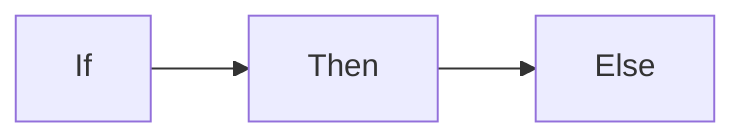
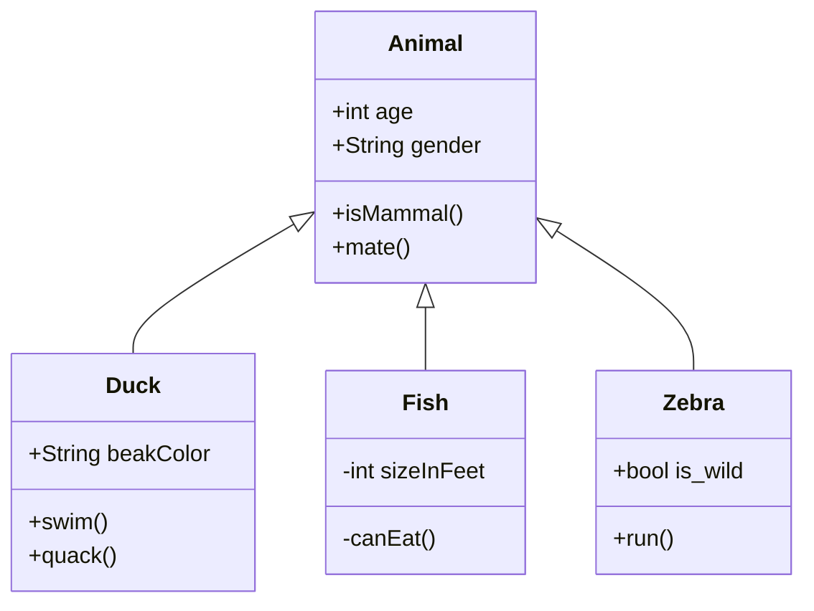

+++
title = "流图(mermaid)"
weight = 9
serialing = true
description = "漂亮的数学和化学公式"
+++
The `mermaid` shortcode generates diagrams and flowcharts from text, in a similar manner as Markdown using the [Mermaid](https://mermaidjs.github.io/) library.


graph LR;
    If --> Then
    Then --> Else


{}
这仅适用于现代浏览器。
{}

## 用法

While the examples are using shortcodes with named parameter it is recommended to use codefences instead. This is because more and more other software supports Mermaid codefences (eg. GitHub) and so your markdown becomes more portable.

You are free to also call this shortcode from your own partials.


{}

````md

````

{}
{}

````go

graph LR;
    If --> Then
    Then --> Else

````

{}



The generated graphs can be be panned by dragging them and zoomed by using the mousewheel. On mobile devices you can use finger gestures.

### 参数

| 名称                  | 默认          | 注释       |
|-----------------------|------------------|-------------|
| **align**             | `center`         | Allowed values are `left`, `center` or `right`. |
| **zoom**              | see notes        | Whether the graph is pan- and zoomable.<br><br>If not set the value is determined by the `mermaidZoom` setting of the [site](#global-configuration-file) or the [pages frontmatter](#pages-frontmatter) or `false` if not set at all.<br><br>- `false`: no pan or zoom<br>- `true`: pan and zoom active |
| _**&lt;content&gt;**_ | _&lt;empty&gt;_  | Your Mermaid graph. |

## 配置

Mermaid is configured with default settings. You can customize Mermaid's default settings for all of your files thru a JSON object in your `hugo.toml`, override these settings per page thru your pages frontmatter or override these setting per diagramm thru [diagram directives](https://mermaid-js.github.io/mermaid/#/directives?id=directives).

The JSON object of your `hugo.toml` / frontmatter is forwarded into Mermaid's `mermaid.initialize()` function.

See [Mermaid documentation](https://mermaid-js.github.io/mermaid/#/Setup?id=mermaidapi-configuration-defaults) for all allowed settings.

The `theme` setting can also be set by your used color variant. This will be the sitewide default and can - again - be overridden by your settings in `hugo.toml`, frontmatter or diagram directives.

### 全局配置文件

```
[params]
  mermaidInitialize = "{ \"theme\": \"dark\" }"
  mermaidZoom = true
```

### 页面 Frontmatter

```
mermaidInitialize = "{ \"theme\": \"dark\" }"
mermaidZoom = true
```

## 案例

### 带 YAML 样式标题的 流程图

````go

---
title: Example Diagram
---
graph LR;
    A[Hard edge] -->|Link text| B(Round edge)
    B --> C{<strong>Decision</strong>}
    C -->|One| D[Result one]
    C -->|Two| E[Result two]

````


---
title: Example Diagram
---
graph LR;
    A[Hard edge] -->|Link text| B(Round edge)
    B --> C{<strong>Decision</strong>}
    C -->|One| D[Result one]
    C -->|Two| E[Result two]


### 带配置指令的序列图

````go

%%{init:{"fontFamily":"monospace", "sequence":{"showSequenceNumbers":true}}}%%
sequenceDiagram
    Alice->>John: Hello John, how are you?
    loop Healthcheck
        John->>John: Fight against hypochondria
    end
    Note right of John: Rational thoughts!
    John-->>Alice: Great!
    John->>Bob: How about you?
    Bob-->>John: Jolly good!

````


%%{init:{"fontFamily":"monospace", "sequence":{"showSequenceNumbers":true}}}%%
sequenceDiagram
    Alice->>John: Hello John, how are you?
    loop Healthcheck
        John->>John: Fight against hypochondria
    end
    Note right of John: Rational thoughts!
    John-->>Alice: Great!
    John->>Bob: How about you?
    Bob-->>John: Jolly good!


### 具有Codefence语法的类图

````go

````

````mermaid
classDiagram
    Animal <|-- Duck
    Animal <|-- Fish
    Animal <|-- Zebra
    Animal : +int age
    Animal : +String gender
    Animal: +isMammal()
    Animal: +mate()
    class Duck{
      +String beakColor
      +swim()
      +quack()
    }
    class Fish{
      -int sizeInFeet
      -canEat()
    }
    class Zebra{
      +bool is_wild
      +run()
    }
````

### 向右对齐的状态图

````go

stateDiagram-v2
    open: Open Door
    closed: Closed Door
    locked: Locked Door
    open   --> closed: Close
    closed --> locked: Lock
    locked --> closed: Unlock
    closed --> open: Open

````


stateDiagram-v2
  open: Open Door
  closed: Closed Door
  locked: Locked Door
  open   --> closed: Close
  closed --> locked: Lock
  locked --> closed: Unlock
  closed --> open: Open


### 非默认主题的实体关系模型

````go

%%{init:{"theme":"forest"}}%%
erDiagram
    CUSTOMER }|..|{ DELIVERY-ADDRESS : has
    CUSTOMER ||--o{ ORDER : places
    CUSTOMER ||--o{ INVOICE : "liable for"
    DELIVERY-ADDRESS ||--o{ ORDER : receives
    INVOICE ||--|{ ORDER : covers
    ORDER ||--|{ ORDER-ITEM : includes
    PRODUCT-CATEGORY ||--|{ PRODUCT : contains
    PRODUCT ||--o{ ORDER-ITEM : "ordered in"

````


%%{init:{"theme":"forest"}}%%
erDiagram
    CUSTOMER }|..|{ DELIVERY-ADDRESS : has
    CUSTOMER ||--o{ ORDER : places
    CUSTOMER ||--o{ INVOICE : "liable for"
    DELIVERY-ADDRESS ||--o{ ORDER : receives
    INVOICE ||--|{ ORDER : covers
    ORDER ||--|{ ORDER-ITEM : includes
    PRODUCT-CATEGORY ||--|{ PRODUCT : contains
    PRODUCT ||--o{ ORDER-ITEM : "ordered in"


### 用户旅程

````go

journey
    title My working day
    section Go to work
      Make tea: 5: Me
      Go upstairs: 3: Me
      Do work: 1: Me, Cat
    section Go home
      Go downstairs: 5: Me
      Sit down: 3: Me

````


journey
    title My working day
    section Go to work
      Make tea: 5: Me
      Go upstairs: 3: Me
      Do work: 1: Me, Cat
    section Go home
      Go downstairs: 5: Me
      Sit down: 3: Me


### 甘特图

````go

gantt
        dateFormat  YYYY-MM-DD
        title Adding GANTT diagram functionality to Mermaid
        section A section
        Completed task            :done,    des1, 2014-01-06,2014-01-08
        Active task               :active,  des2, 2014-01-09, 3d
        Future task               :         des3, after des2, 5d
        Future task2              :         des4, after des3, 5d
        section Critical tasks
        Completed task in the critical line :crit, done, 2014-01-06,24h
        Implement parser and jison          :crit, done, after des1, 2d
        Create tests for parser             :crit, active, 3d
        Future task in critical line        :crit, 5d
        Create tests for renderer           :2d
        Add to Mermaid                      :1d

````


gantt
        dateFormat  YYYY-MM-DD
        title Adding GANTT diagram functionality to Mermaid
        section A section
        Completed task            :done,    des1, 2014-01-06,2014-01-08
        Active task               :active,  des2, 2014-01-09, 3d
        Future task               :         des3, after des2, 5d
        Future task2              :         des4, after des3, 5d
        section Critical tasks
        Completed task in the critical line :crit, done, 2014-01-06,24h
        Implement parser and jison          :crit, done, after des1, 2d
        Create tests for parser             :crit, active, 3d
        Future task in critical line        :crit, 5d
        Create tests for renderer           :2d
        Add to Mermaid                      :1d


### 不带缩放的饼图

````go

pie title Pets adopted by volunteers
    "Dogs" : 386
    "Cats" : 85
    "Rats" : 15

````


pie title Pets adopted by volunteers
    "Dogs" : 386
    "Cats" : 85
    "Rats" : 15


### 象限图

````go

pie title Pets adopted by volunteers
    title Reach and engagement of campaigns
    x-axis Low Reach --> High Reach
    y-axis Low Engagement --> High Engagement
    quadrant-1 We should expand
    quadrant-2 Need to promote
    quadrant-3 Re-evaluate
    quadrant-4 May be improved
    Campaign A: [0.3, 0.6]
    Campaign B: [0.45, 0.23]
    Campaign C: [0.57, 0.69]
    Campaign D: [0.78, 0.34]
    Campaign E: [0.40, 0.34]
    Campaign F: [0.35, 0.78]

````


quadrantChart
    title Reach and engagement of campaigns
    x-axis Low Reach --> High Reach
    y-axis Low Engagement --> High Engagement
    quadrant-1 We should expand
    quadrant-2 Need to promote
    quadrant-3 Re-evaluate
    quadrant-4 May be improved
    Campaign A: [0.3, 0.6]
    Campaign B: [0.45, 0.23]
    Campaign C: [0.57, 0.69]
    Campaign D: [0.78, 0.34]
    Campaign E: [0.40, 0.34]
    Campaign F: [0.35, 0.78]


### 需求图

````go

    requirementDiagram

    requirement test_req {
    id: 1
    text: the test text.
    risk: high
    verifymethod: test
    }

    element test_entity {
    type: simulation
    }

    test_entity - satisfies -> test_req

````


    requirementDiagram

    requirement test_req {
    id: 1
    text: the test text.
    risk: high
    verifymethod: test
    }

    element test_entity {
    type: simulation
    }

    test_entity - satisfies -> test_req


### Git 图

````go

gitGraph
    commit
    commit
    branch develop
    checkout develop
    commit
    commit
    checkout main
    merge develop
    commit
    commit

````


gitGraph
    commit
    commit
    branch develop
    checkout develop
    commit
    commit
    checkout main
    merge develop
    commit
    commit


### C4 图

````go

C4Context
    title System Context diagram for Internet Banking System
    Enterprise_Boundary(b0, "BankBoundary0") {
    Person(customerA, "Banking Customer A", "A customer of the bank, with personal bank accounts.")
    Person(customerB, "Banking Customer B")
    Person_Ext(customerC, "Banking Customer C", "desc")

    Person(customerD, "Banking Customer D", "A customer of the bank, <br/> with personal bank accounts.")

    System(SystemAA, "Internet Banking System", "Allows customers to view information about their bank accounts, and make payments.")

    Enterprise_Boundary(b1, "BankBoundary") {

        SystemDb_Ext(SystemE, "Mainframe Banking System", "Stores all of the core banking information about customers, accounts, transactions, etc.")

        System_Boundary(b2, "BankBoundary2") {
        System(SystemA, "Banking System A")
        System(SystemB, "Banking System B", "A system of the bank, with personal bank accounts. next line.")
        }

        System_Ext(SystemC, "E-mail system", "The internal Microsoft Exchange e-mail system.")
        SystemDb(SystemD, "Banking System D Database", "A system of the bank, with personal bank accounts.")

        Boundary(b3, "BankBoundary3", "boundary") {
        SystemQueue(SystemF, "Banking System F Queue", "A system of the bank.")
        SystemQueue_Ext(SystemG, "Banking System G Queue", "A system of the bank, with personal bank accounts.")
        }
    }
    }

    BiRel(customerA, SystemAA, "Uses")
    BiRel(SystemAA, SystemE, "Uses")
    Rel(SystemAA, SystemC, "Sends e-mails", "SMTP")
    Rel(SystemC, customerA, "Sends e-mails to")

    UpdateElementStyle(customerA, $fontColor="red", $bgColor="grey", $borderColor="red")
    UpdateRelStyle(customerA, SystemAA, $textColor="blue", $lineColor="blue", $offsetX="5")
    UpdateRelStyle(SystemAA, SystemE, $textColor="blue", $lineColor="blue", $offsetY="-10")
    UpdateRelStyle(SystemAA, SystemC, $textColor="blue", $lineColor="blue", $offsetY="-40", $offsetX="-50")
    UpdateRelStyle(SystemC, customerA, $textColor="red", $lineColor="red", $offsetX="-50", $offsetY="20")

    UpdateLayoutConfig($c4ShapeInRow="3", $c4BoundaryInRow="1")

````


C4Context
    title System Context diagram for Internet Banking System
    Enterprise_Boundary(b0, "BankBoundary0") {
    Person(customerA, "Banking Customer A", "A customer of the bank, with personal bank accounts.")
    Person(customerB, "Banking Customer B")
    Person_Ext(customerC, "Banking Customer C", "desc")

    Person(customerD, "Banking Customer D", "A customer of the bank, <br/> with personal bank accounts.")

    System(SystemAA, "Internet Banking System", "Allows customers to view information about their bank accounts, and make payments.")

    Enterprise_Boundary(b1, "BankBoundary") {

        SystemDb_Ext(SystemE, "Mainframe Banking System", "Stores all of the core banking information about customers, accounts, transactions, etc.")

        System_Boundary(b2, "BankBoundary2") {
        System(SystemA, "Banking System A")
        System(SystemB, "Banking System B", "A system of the bank, with personal bank accounts. next line.")
        }

        System_Ext(SystemC, "E-mail system", "The internal Microsoft Exchange e-mail system.")
        SystemDb(SystemD, "Banking System D Database", "A system of the bank, with personal bank accounts.")

        Boundary(b3, "BankBoundary3", "boundary") {
        SystemQueue(SystemF, "Banking System F Queue", "A system of the bank.")
        SystemQueue_Ext(SystemG, "Banking System G Queue", "A system of the bank, with personal bank accounts.")
        }
    }
    }

    BiRel(customerA, SystemAA, "Uses")
    BiRel(SystemAA, SystemE, "Uses")
    Rel(SystemAA, SystemC, "Sends e-mails", "SMTP")
    Rel(SystemC, customerA, "Sends e-mails to")

    UpdateElementStyle(customerA, $fontColor="red", $bgColor="grey", $borderColor="red")
    UpdateRelStyle(customerA, SystemAA, $textColor="blue", $lineColor="blue", $offsetX="5")
    UpdateRelStyle(SystemAA, SystemE, $textColor="blue", $lineColor="blue", $offsetY="-10")
    UpdateRelStyle(SystemAA, SystemC, $textColor="blue", $lineColor="blue", $offsetY="-40", $offsetX="-50")
    UpdateRelStyle(SystemC, customerA, $textColor="red", $lineColor="red", $offsetX="-50", $offsetY="20")

    UpdateLayoutConfig($c4ShapeInRow="3", $c4BoundaryInRow="1")


### 思维导图

````go

mindmap
  root((mindmap))
    Origins
      Long history
      ::icon(fa fa-book)
      Popularisation
        British popular psychology author Tony Buzan
    Research
      On effectiveness<br/>and features
      On Automatic creation
        Uses
            Creative techniques
            Strategic planning
            Argument mapping
    Tools
      Pen and paper
      Mermaid

````


mindmap
  root((mindmap))
    Origins
      Long history
      ::icon(fa fa-book)
      Popularisation
        British popular psychology author Tony Buzan
    Research
      On effectiveness<br/>and features
      On Automatic creation
        Uses
            Creative techniques
            Strategic planning
            Argument mapping
    Tools
      Pen and paper
      Mermaid


### 时间线

````go

timeline
    title History of Social Media Platform
    2002 : LinkedIn
    2004 : Facebook
         : Google
    2005 : Youtube
    2006 : Twitter

````


timeline
    title History of Social Media Platform
    2002 : LinkedIn
    2004 : Facebook
         : Google
    2005 : Youtube
    2006 : Twitter


### 桑基

````go

sankey-beta

%% source,target,value
Electricity grid,Over generation / exports,104.453
Electricity grid,Heating and cooling - homes,113.726
Electricity grid,H2 conversion,27.14

````


sankey-beta

%% source,target,value
Electricity grid,Over generation / exports,104.453
Electricity grid,Heating and cooling - homes,113.726
Electricity grid,H2 conversion,27.14


### XYChart

````go

xychart-beta
    title "Sales Revenue"
    x-axis [jan, feb, mar, apr, may, jun, jul, aug, sep, oct, nov, dec]
    y-axis "Revenue (in $)" 4000 --> 11000
    bar [5000, 6000, 7500, 8200, 9500, 10500, 11000, 10200, 9200, 8500, 7000, 6000]
    line [5000, 6000, 7500, 8200, 9500, 10500, 11000, 10200, 9200, 8500, 7000, 6000]

````


xychart-beta
    title "Sales Revenue"
    x-axis [jan, feb, mar, apr, may, jun, jul, aug, sep, oct, nov, dec]
    y-axis "Revenue (in $)" 4000 --> 11000
    bar [5000, 6000, 7500, 8200, 9500, 10500, 11000, 10200, 9200, 8500, 7000, 6000]
    line [5000, 6000, 7500, 8200, 9500, 10500, 11000, 10200, 9200, 8500, 7000, 6000]


### 块图

````go

block-beta
columns 1
  db(("DB"))
  blockArrowId6<["&nbsp;&nbsp;&nbsp;"]>(down)
  block:ID
    A
    B["A wide one in the middle"]
    C
  end
  space
  D
  ID --> D
  C --> D
  style B fill:#969,stroke:#333,stroke-width:4px

````


block-beta
columns 1
  db(("DB"))
  blockArrowId6<["&nbsp;&nbsp;&nbsp;"]>(down)
  block:ID
    A
    B["A wide one in the middle"]
    C
  end
  space
  D
  ID --> D
  C --> D
  style B fill:#969,stroke:#333,stroke-width:4px

